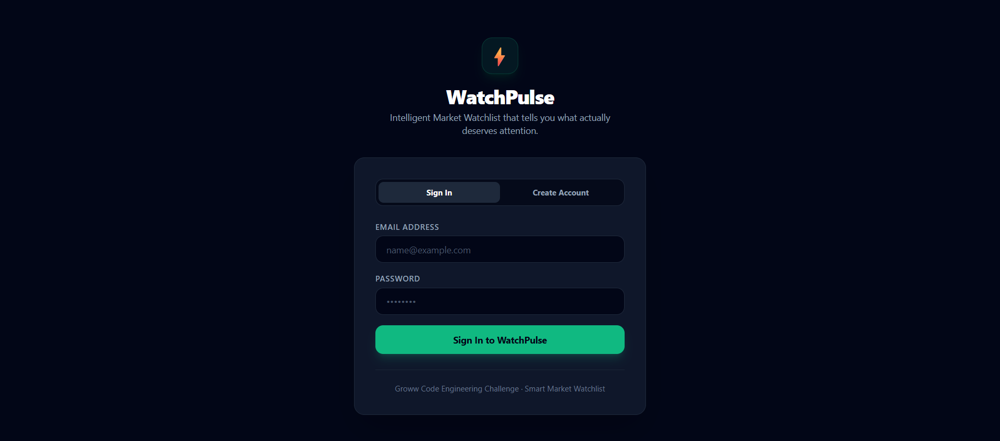
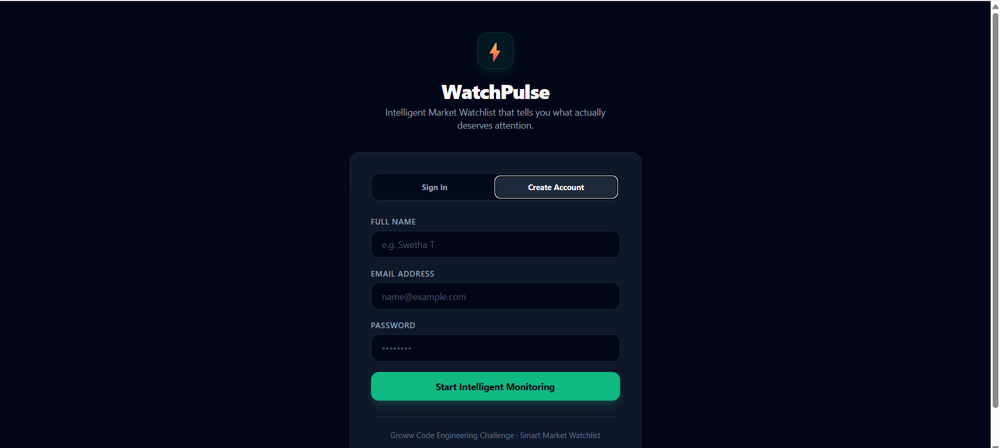
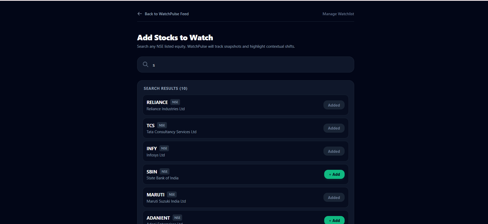
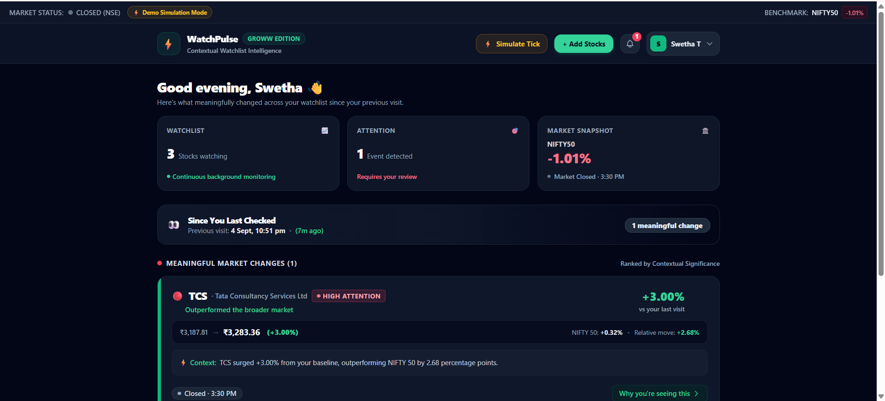
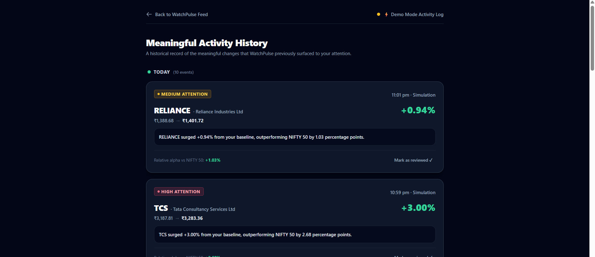
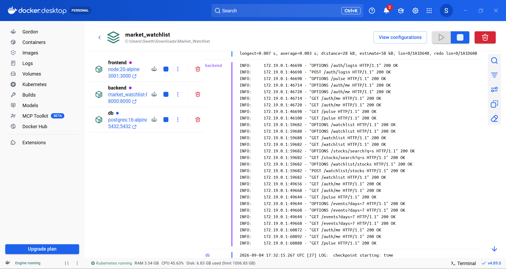

# ⚡ Groww WatchPulse — Intelligent Market Watchlist

> **Groww Code Solution**: A Smart Market Watchlist that watches user-selected stocks in the background and surfaces **what meaningfully changed and deserves attention since their last visit**.

---

## 💡 1. Problem Statement & Product Idea

### The Problem with Normal Watchlists
A typical market watchlist presents a wall of numbers with raw daily percentage changes:
```text
RELIANCE     ₹1,420    +2.1%
TCS          ₹3,210    +0.4%
INFY         ₹1,540    -0.2%
HDFCBANK     ₹1,680    +3.5%
```
The user must still manually scan every stock, remember their own purchase/visit baseline, and mentally calculate whether a stock's move was genuine momentum or just broad market drift.

### The WatchPulse Solution: *"The Watchlist Watches Itself"*
When a user returns to Groww, WatchPulse directly answers:
> **“What meaningfully changed in my watchlist since my last visit, and what actually deserves my attention?”**

---

## 🎯 2. Product Hierarchy

WatchPulse organizes market data into 3 distinct layers:

```text
┌─────────────────────────────────────────────────────────────────────────┐
│ 🔴 PULSE CARDS                                                          │
│ "Hey, this stock deserves your attention!"                              │
│                                                                         │
│ 🔴 RELIANCE · Reliance Industries Ltd           [ HIGH ATTENTION ]     │
│ Outperformed the broader market                                         │
│                                                                         │
│ ₹1,420.00 → ₹1,480.00 (+4.23%)                                          │
│ NIFTY 50: +0.50%  •  Relative excess alpha: +3.73%                      │
│                                                                         │
│ ⚡ Context: RELIANCE surged +4.23% from your baseline, outperforming    │
│ NIFTY 50 by 3.73 percentage points.                                     │
│                                                                         │
│ [Closed · 3:30 PM]                             [Why you're seeing this →]│
└─────────────────────────────────────────────────────────────────────────┘

┌─────────────────────────────────────────────────────────────────────────┐
│ ✓ QUIET STOCKS                                                          │
│ "Nothing significant happened — moved within normal market noise"       │
│                                                                         │
│ ✓ TCS          ₹3,200.00 → ₹3,210.00 (+0.31%)     ● Closed · 3:30 PM    │
│ ✓ INFY         ₹1,540.00 → ₹1,542.00 (+0.13%)     ● Closed · 3:30 PM    │
└─────────────────────────────────────────────────────────────────────────┘

┌─────────────────────────────────────────────────────────────────────────┐
│ 📜 ACTIVITY HISTORY                                                     │
│ "Persistent memory of what WatchPulse previously noticed for you"       │
│                                                                         │
│ Today                                                                   │
│ 🟡 MARUTI     -2.06%  (Underperformed NIFTY 50 by 1.45%)  [Reviewed ✓] │
│ 🔴 TCS        +1.50%  (Outperformed NIFTY 50 by 2.11%)    [Reviewed ✓] │
└─────────────────────────────────────────────────────────────────────────┘
```

---

## 🧠 3. Unique Product & Engineering Insight

1. **User Baseline (Not Midnight)**:
   The comparison baseline is when **this particular user last checked**, rather than arbitrary daily market opens.
2. **Contextual Excess Alpha ($\Delta_{stock} - \Delta_{market}$)**:
   A stock up $+3.0\%$ during a day where the NIFTY 50 moved $+2.8\%$ is merely moving with the market tide (quiet stock). But a stock up $+3.0\%$ when NIFTY is flat ($+0.2\%$) creates a $+2.8\%$ excess alpha that warrants high attention.
3. **Explainability Over Black-Box Numbers**:
   Every alert comes with natural-language evidence explaining *why* it was surfaced.
4. **Attention, Not Financial Advice**:
   WatchPulse highlights **observable statistical significance**, not speculative buy/sell calls.

---

## 🏗️ 4. System Architecture

Built as a **modular monolith** optimized for scalability, resilience, and maintainability:

```text
                     React Frontend (Vite + Tailwind)
                                   │
                                   ▼ [REST API / JWT Auth]
                          FastAPI Backend
                                   │
                 ┌─────────────────┼─────────────────┐
                 │                 │                 │
                 ▼                 ▼                 ▼
          Watchlist Service  Market Data Service  Change Engine
                 │                 │                 │
                 │                 ▼                 ▼
                 │            Providers       Attention Ranker
                 │          (Mock / Yahoo)           │
                 │                 │                 ▼
                 └────────────┬────┴─────────── Event Service
                              ▼
                         PostgreSQL
         (Users, Stocks, Baselines, Snapshots, Events)
```

### Shared Market-Data Ingestion Layer
Instead of each user triggering independent API requests for the same stock, market data is ingested centrally and cached:
```text
           External Market API / Mock
                       │
                       ▼
             Market Data Service
                       │
          ┌────────────┼────────────┐
          ▼            ▼            ▼
         TCS          INFY       RELIANCE
          │            │            │
          └────────────┼────────────┘
                       ▼
             Central Snapshot Store
                       │
            ┌──────────┼──────────┐
            ▼          ▼          ▼
         User A     User B     User C
```
If 10,000 users have TCS on their watchlist, a single TCS snapshot serves all of them.

---

## 📊 5. Database Schema

1. **`users`**: Secure account credentials with direct `bcrypt` hashing and JWT tokens.
2. **`stocks`**: Pre-seeded active NSE stock universe with company names.
3. **`watchlist_items`**: User-selected stocks with `UNIQUE(user_id, stock_id)` constraints.
4. **`user_baselines`**: **The Core Mechanism**. Stores `user_id`, `last_visited_at`, `snapshot_json` (prices at user's last visit), and benchmark state.
5. **`market_snapshots`**: Centralized timestamped price records with data freshness tags.
6. **`benchmark_snapshots`**: Periodic NIFTY 50 index values for relative calculations.
7. **`attention_events`**: Persistent historical audit trail of surfaced attention cards.

---

## ⚙️ 6. Change Detection Algorithm

```text
For each stock S in user's watchlist:
  stock_delta_pct = (price_current - price_baseline) / price_baseline * 100
  bench_delta_pct = (bench_current - bench_baseline) / bench_baseline * 100
  relative_alpha  = stock_delta_pct - bench_delta_pct

  abs_stock = |stock_delta_pct|
  abs_rel   = |relative_alpha|

  Classification:
    OUTPERFORM   ← relative_alpha >= +1.0% (HIGH if >= +2.0% or abs_stock >= 3.0%)
    UNDERPERFORM ← relative_alpha <= -1.0% (HIGH if <= -2.0% or abs_stock >= 3.0%)
    PRICE_MOVE   ← abs_stock >= 1.5% (HIGH if >= 3.0%, MEDIUM if >= 1.5%)
    NONE         ← Quiet Stock (movement within standard market variance)
```

---

## 🛡️ 7. Edge Cases & Resilience

| Edge Case | Engineering Solution |
|---|---|
| **First-Time Visit** | Initializes `user_baselines` on first visit. Welcomes the user with $0\%$ change rather than false alarms. |
| **Market Closed Hours** | `is_market_open()` utility monitors NSE trading hours (09:15–15:30 IST, Mon–Fri). Status bar explicitly tags off-hours as `Closed (NSE)` without false stale warnings. |
| **Demo / Simulation Mode** | When running simulations or off-hours testing, UI displays a prominent `⚡ Demo Simulation Mode` badge and tags events with `· Simulation`. |
| **Stale / Delayed Data** | `classify_freshness()` tags snapshots `< 2 min` as Live, `< 15 min` as Delayed, and `> 15 min` as Unavailable with a warning banner. |
| **Provider API Outage** | Automatically serves last-known cached snapshots from PostgreSQL and displays data freshness warnings without crashing. |
| **Duplicate Stocks** | Database `UniqueConstraint(user_id, stock_id)` prevents duplicates and returns HTTP 409 Conflict. |
| **Stock Removal** | Implemented directly from both the **Dashboard** (hover trash icon) and the **Add Stocks Page**. |
| **Concurrency / Refresh Spam** | Wraps baseline updates during `/pulse` in atomic transactions with `with_for_update()` database row locks. |
| **Multi-User Isolation** | Complete user isolation enforced at the database level via JWT session claims (`Depends(get_current_user)`). |

---

## 🚀 8. Quick Start

### Option 1: Docker Compose (Recommended)

```bash
docker compose up -d
```

Open in your browser:
* 🌐 **WatchPulse Frontend**: **[http://localhost:3001](http://localhost:3001)**
* 📖 **Interactive Swagger API Docs**: **[http://localhost:8000/docs](http://localhost:8000/docs)**

---

### Option 2: Manual Local Setup

#### 1. Backend
```bash
cd backend
python -m venv venv
.\venv\Scripts\activate      # on Windows (source venv/bin/activate on Mac/Linux)
pip install -r requirements.txt
python -m app.seed
uvicorn app.main:app --reload --port 8000
```

#### 2. Frontend
```bash
cd frontend
npm install
npm run dev -- --port 3001
```

---

## 🧪 9. Running Tests

Automated tests cover all calculation models, alpha thresholding, and ranking logic:

```bash
# Run backend test suite
cd backend
pytest tests/ -v
```

Test coverage includes:
- `test_change_engine.py`: Relative alpha formulas, evidence explanation generation, outperformance/underperformance detection.
- `test_attention_ranker.py`: Priority sorting (High > Medium > Low), Quiet Stocks filtering, empty state handling.

---

## 🏆 10. Final Product Pitch

1. **Information Overload Solved**: We transformed noisy market tickers into actionable contextual insights.
2. **Mathematically Grounded**: We separate signal from noise by isolating company-specific alpha from macroeconomic market drift.
3. **Engineered for Scale**: Centralized caching, atomic baseline transactions, multi-user isolation, and zero redundant polling.
4. **Groww-Native Experience**: Fast, clean, dark-mode design with explainable evidence drawers and full audit history.

---

## 📸 11. Product Screenshots

### 🔐 Login & Registration
*Tabbed modern authentication with email validation and instant profile generation.*


---

### ➕ Add Stocks to Watchlist

---

### 📊 Groww-Style Dashboard

---


### 📜 Activity History

---

## 🧪 12. Demo / Evaluation Flow

For evaluators and judges reviewing WatchPulse:

1. **Sign In**: Register a new account or log in. Your personal baseline is automatically initialized.
2. **Add Stocks**: Navigate to `+ Add Stocks` and add 4–5 blue-chip stocks (e.g., *RELIANCE, TCS, MARUTI, INFY, HDFCBANK*).
3. **Inspect Initial State**: Return to Dashboard — note that stocks are categorized as Quiet since no time has elapsed ($0\%$ change from baseline).
4. **Simulate Market Tick**: Click **⚡ Simulate Tick** on the Dashboard (or make a `POST /market/simulate` call).
5. **Observe Attention Engine**:
   - Stocks with relative excess alpha $> 1.0\%$ or absolute move $> 1.5\%$ become **Pulse Cards**.
   - Stocks with minimal drift remain in **Quiet Stocks**.
   - Click **Why you're seeing this** on any Pulse Card to inspect the mathematical alpha decomposition.
6. **Check Activity History**: Navigate to **Activity History** to review the persistent audit trail with simulation badges.

---

## 🔌 13. API Overview

| Method | Endpoint | Description | Auth Required |
|---|---|---|:---:|
| `POST` | `/auth/register` | Create user account & return JWT token + user profile | No |
| `POST` | `/auth/login` | Authenticate user & return JWT token | No |
| `GET` | `/auth/me` | Fetch currently logged-in user profile (`name`, `email`) | Yes |
| `GET` | `/watchlist` | List user's active watchlist items | Yes |
| `POST` | `/watchlist/stocks` | Add stock to user's watchlist (`UNIQUE` constraint) | Yes |
| `DELETE` | `/watchlist/stocks/{symbol}` | Remove stock from user's watchlist | Yes |
| `GET` | `/stocks/search?q={query}` | Search active stock universe by symbol or company name | Yes |
| `GET` | `/pulse` | **Core Engine**: Evaluates watchlist vs. user baseline & returns Pulse cards | Yes |
| `GET` | `/events?days=7` | Retrieve chronological audit history of surfaced attention events | Yes |
| `PATCH` | `/events/{id}/acknowledge` | Mark an attention event as reviewed (persistent) | Yes |
| `GET` | `/market/status` | Current NSE market session status & last data timestamp | No |
| `POST` | `/market/simulate` | Trigger a new market tick simulation for testing | No |
| `GET` | `/market/snapshot/{symbol}` | Fetch latest recorded snapshot for a specific stock | No |

---

## 🐳 14. Docker & Deployment

WatchPulse is completely containerized with Docker Compose for seamless single-command startup:

```bash
docker compose up --build -d
```



* Services:
  - **`db`**: PostgreSQL 16 Alpine with persistent data volume & healthcheck.
  - **`backend`**: Python FastAPI app with automatic schema creation & seed data on boot.
  - **`frontend`**: React Vite application running on port `3001` (hot-reload enabled).

---

## 📁 15. Project Structure

```
Market_Watchlist/
├── backend/
│   ├── app/
│   │   ├── main.py                     # FastAPI application with CORS & lifespan scheduler
│   │   ├── config.py                   # Pydantic Settings & threshold configuration
│   │   ├── database.py                 # SQLAlchemy engine & session factory
│   │   ├── models/                     # Database Models (User, Stock, Baseline, Snapshots, Events)
│   │   ├── schemas/                    # Pydantic Request/Response validation schemas
│   │   ├── providers/                  # BaseProvider, MockProvider (random walk), YahooProvider
│   │   ├── services/                   # ChangeEngine, AttentionRanker, MarketData, Auth, Watchlist
│   │   ├── routers/                    # API Route Controllers (auth, watchlist, pulse, market, events)
│   │   ├── utils/                      # IST market hours & data freshness classification
│   │   └── seed.py                     # Auto-seed script for 30 NSE blue-chip stocks
│   ├── scheduler/
│   │   └── polling_job.py              # APScheduler background polling worker
│   ├── tests/
│   │   ├── test_change_engine.py       # Unit tests for relative alpha & severity logic
│   │   └── test_attention_ranker.py    # Unit tests for attention sorting & quiet filtering
│   ├── requirements.txt
│   ├── Dockerfile
│   └── .env.example
├── frontend/
│   ├── src/
│   │   ├── api/
│   │   │   └── client.js               # Axios client with JWT request/response interceptors
│   │   ├── components/
│   │   │   ├── AttentionBadge.jsx      # HIGH / MEDIUM / LOW severity tags
│   │   │   ├── FreshnessTag.jsx        # Live / Delayed / Unavailable / Closed pills
│   │   │   ├── MarketStatusBar.jsx     # Live NSE status ticker & benchmark snapshot
│   │   │   ├── PulseCard.jsx           # Main meaningful change card with price transition
│   │   │   ├── QuietStock.jsx          # Clean row for stocks within normal market noise
│   │   │   └── WhyPanel.jsx            # Slide-out explanation drawer with alpha breakdown
│   │   ├── hooks/
│   │   │   └── usePulse.js             # Polling hook with 60s auto-refresh & manual trigger
│   │   ├── pages/
│   │   │   ├── AddStocksPage.jsx       # Real-time search & watchlist manager
│   │   │   ├── DashboardPage.jsx       # Groww-style dashboard with greeting & stat cards
│   │   │   ├── HistoryPage.jsx         # 7-day chronological audit log of attention events
│   │   │   ├── LoginPage.jsx           # Tabbed Sign In / Register authentication form
│   │   │   └── StockDetailPage.jsx     # Detailed price snapshot & context view
│   │   ├── utils/
│   │   │   └── format.js               # INR (₹) price formatting & relative time helpers
│   │   ├── App.jsx                     # React Router & ProtectedRoute wrappers
│   │   ├── main.jsx                    # React entry point
│   │   └── index.css                   # Dark theme styling & Tailwind directives
│   ├── package.json
│   ├── vite.config.js
│   ├── tailwind.config.js
│   └── postcss.config.js
├── docker-compose.yml                  # Multi-container orchestration (Postgres, Backend, Frontend)
└── README.md                           # Documentation & judge presentation pitch
```

---

## 🛠️ 16. Technology Stack

| Layer | Technology | Rationale |
|---|---|---|
| **Frontend Framework** | **React 18** (Vite) | Blazing fast build tooling, reactive hooks, component modularity |
| **Styling & Design System** | **Tailwind CSS v3** | Modern dark Groww-styled palette, clean typography, responsive layout |
| **Backend API** | **Python FastAPI** | High-performance asynchronous REST API with automatic OpenAPI documentation |
| **Data Validation** | **Pydantic v2** | Strict type enforcement and automatic request/response serialization |
| **Database & ORM** | **PostgreSQL 16** + **SQLAlchemy 2.0** | ACID compliance, JSONB baseline storage, and relational integrity |
| **Background Polling** | **APScheduler** | Independent market ingestion detached from user request lifecycles |
| **Authentication** | **JWT (python-jose)** + **bcrypt** | Secure, stateless authentication with password hashing |
| **Containerization** | **Docker & Docker Compose** | Reproducible multi-service deployment with healthchecks |
| **Testing** | **Pytest** | Automated unit tests for mathematical engines and ranking algorithms |

---

## 🔮 17. Future Enhancements

1. **Volume Anomaly Detection**:
   Flag unusual intraday trading volume surges ($>2\times$ 20-day average) as standalone contextual events.
2. **Push / WhatsApp Digest**:
   Send a daily end-of-day summary of only the stocks that experienced meaningful shifts.
3. **Sectoral Grouping & Attribution**:
   Decompose excess alpha into Sector Performance (e.g. NIFTY IT) vs. Company-Specific Alpha.
4. **Multiple Custom Watchlists**:
   Allow users to organize stocks into separate themes (e.g., *"Long-Term Core"*, *"High Beta"*, *"Dividend"*).
